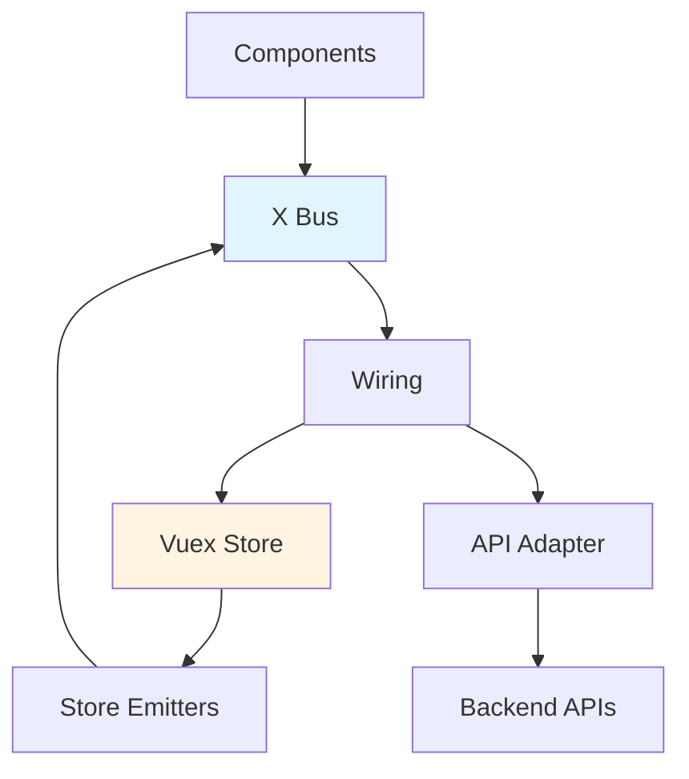
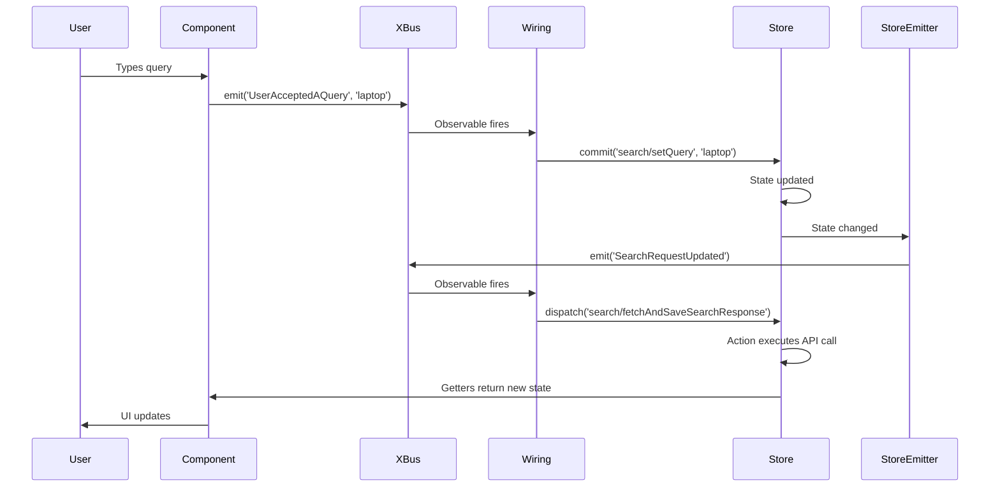

Interface X is built on a sophisticated architecture that combines Vue.js reactivity with event-driven communication and modular state management. This page provides an overview of how all the pieces fit together.

## System Design

Interface X follows a **modular, event-driven architecture** where independent modules communicate through a centralized event bus. Each module encapsulates its own state, logic, and UI components while remaining loosely coupled from other modules.



### Key Architectural Layers

<AccordionGroup>
  <Accordion title="Presentation Layer (Components)">
    Vue.js components that render UI and capture user interactions. Components emit events to the X Bus and consume state from the Vuex store.
    
    - Reusable, composable Vue components
    - Emit user action events (clicks, inputs, etc.)
    - Subscribe to store state using getters
    - No direct module-to-module dependencies
  </Accordion>

  <Accordion title="Event Layer (X Bus)">
    A priority-based event bus built on RxJS that manages all cross-module communication. Events flow through the bus to trigger wires in various modules.
    
    - Centralized event distribution
    - Priority queue for event ordering
    - Observable-based subscriptions
    - Event metadata support
  </Accordion>

  <Accordion title="Integration Layer (Wiring)">
    The wiring system connects events to actions. When an event is emitted, wires execute in response, typically dispatching actions or committing mutations to the store.
    
    - Declarative event-to-action mapping
    - Support for multiple wires per event
    - Access to store and additional events
    - Customizable per module
  </Accordion>

  <Accordion title="State Layer (Vuex Store)">
    A type-safe Vuex store managing all application state. Each X Module has its own namespaced store module with state, getters, mutations, and actions.
    
    - Namespaced modules under `x.*`
    - Type-safe state access
    - Centralized state management
    - Predictable state mutations
  </Accordion>

  <Accordion title="API Layer (Adapter)">
    The adapter abstracts backend API communication, allowing you to connect to any search/discovery API while keeping the rest of the system unchanged.
    
    - Pluggable adapter pattern
    - Request/response transformation
    - Multiple backend support
    - Extensible for custom APIs
  </Accordion>
</AccordionGroup>

## Monorepo Structure

Interface X is organized as a monorepo using Lerna and pnpm workspaces, with multiple packages working together:

```
packages/
├── x-components/          # Main component library
│   ├── src/
│   │   ├── x-modules/     # Feature modules (search, facets, etc.)
│   │   ├── components/    # Shared UI components
│   │   ├── x-bus/         # Event bus implementation
│   │   ├── wiring/        # Wiring utilities and types
│   │   ├── store/         # Vuex store utilities
│   │   └── plugins/       # Vue plugins (XPlugin)
├── x-adapter/             # Base adapter interfaces
├── x-adapter-platform/    # Empathy Platform adapter
├── x-types/               # Shared TypeScript types
├── x-utils/               # Utility functions
├── x-design-system/       # UI design tokens
├── x-tailwindcss/         # Tailwind configuration
└── x-archetype-utils/     # Build utilities
```

### Package Relationships

<CodeGroup>
```typescript x-components Dependencies
// x-components depends on:
import { XComponentsAdapter } from '@empathyco/x-types'
import { deepMerge } from '@empathyco/x-deep-merge'
import { Dictionary } from '@empathyco/x-utils'

// Provides:
export { XPlugin } from './plugins/x-plugin'
export { xModules } from './x-modules'
export { XBus } from './x-bus'
```

```typescript Adapter Integration
// x-adapter provides base interfaces
export interface XComponentsAdapter {
  search(request: SearchRequest): Observable<SearchResponse>
  recommendations(request: RecommendationsRequest): Observable<RecommendationsResponse>
  // ...
}

// x-adapter-platform implements for Empathy API
export const platformAdapter: XComponentsAdapter = {
  // Implementation
}
```
</CodeGroup>

## Module Registration Flow

When you import a component from an X Module, the module automatically registers itself with the XPlugin:

```typescript
// From: x-modules/search/x-module.ts
export const searchXModule: SearchXModule = {
  name: 'search',
  storeModule: searchXStoreModule,
  storeEmitters: searchEmitters,
  wiring: searchWiring,
}

// Auto-registers on import
XPlugin.registerXModule(searchXModule)
```

### Registration Steps

1. **Import Component** - When you import any component from a module
2. **Module Definition** - The module's `x-module.ts` file is executed
3. **Auto-registration** - `XPlugin.registerXModule()` is called
4. **Store Registration** - The module's Vuex store is registered under `x.[moduleName]`
5. **Emitter Setup** - Store emitters are configured to watch state changes
6. **Wiring Connection** - Event wires are subscribed to the X Bus
7. **Ready** - The module is ready to handle events and render components

<Note>
  Modules are registered lazily - only when you actually import and use them. This keeps your bundle size optimized.
</Note>

## Data Flow Example

Let's trace what happens when a user types in the search box:



<Steps>
  <Step title="User Action">
    User types a query in the search box component
  </Step>
  
  <Step title="Event Emission">
    Component emits `UserAcceptedAQuery` event to X Bus with the query string
  </Step>
  
  <Step title="Wire Execution">
    Search module's wiring receives the event and commits `setQuery` mutation
  </Step>
  
  <Step title="State Update">
    Vuex store updates the search module's `query` state
  </Step>
  
  <Step title="Store Emitter">
    Store emitter detects the change and emits `SearchRequestUpdated` event
  </Step>
  
  <Step title="API Call">
    Another wire responds to `SearchRequestUpdated` and dispatches `fetchAndSaveSearchResponse`
  </Step>
  
  <Step title="UI Update">
    Components reactively update based on new state from getters
  </Step>
</Steps>

## Type Safety

Interface X is built with TypeScript throughout, providing comprehensive type safety:

```typescript
// All events are strongly typed
interface XEventsTypes {
  UserAcceptedAQuery: string
  SearchResponseChanged: SearchResponse
  UserClickedAResult: Result
  // ... 100+ typed events
}

// Store modules are type-safe
interface SearchXStoreModule extends XStoreModule<
  SearchState,      // State shape
  SearchGetters,    // Getter return types
  SearchMutations,  // Mutation signatures
  SearchActions     // Action signatures
> {}

// Extract types from modules
type SearchState = ExtractState<'search'>
type SearchGetters = ExtractGetters<'search'>
```

## Plugin Installation

The XPlugin is the entry point that bootstraps the entire system:

```typescript
import { createApp } from 'vue'
import { xPlugin } from '@empathyco/x-components'
import { platformAdapter } from '@empathyco/x-adapter-platform'

const app = createApp(App)

app.use(xPlugin, {
  adapter: platformAdapter,
  
  // Optional: Customize modules
  xModules: {
    search: {
      config: { pageSize: 24 },
      wiring: {
        // Override default wiring
      }
    }
  }
})
```

<Card title="Next: Learn About X Modules" icon="boxes" href="./x-modules">
  Dive deeper into the modular system that powers Interface X
</Card>

## Benefits of This Architecture

<CardGroup cols={2}>
  <Card title="Modularity" icon="cube">
    Each module is self-contained with its own state, events, and components
  </Card>
  
  <Card title="Decoupling" icon="link-slash">
    Modules communicate only through events - no direct dependencies
  </Card>
  
  <Card title="Extensibility" icon="puzzle-piece">
    Easy to add new modules or customize existing ones
  </Card>
  
  <Card title="Type Safety" icon="shield-check">
    Full TypeScript support catches errors at compile time
  </Card>
  
  <Card title="Testability" icon="vial">
    Pure functions and isolated modules make testing straightforward
  </Card>
  
  <Card title="Performance" icon="gauge-high">
    Lazy loading and tree-shaking keep bundle sizes minimal
  </Card>
</CardGroup>