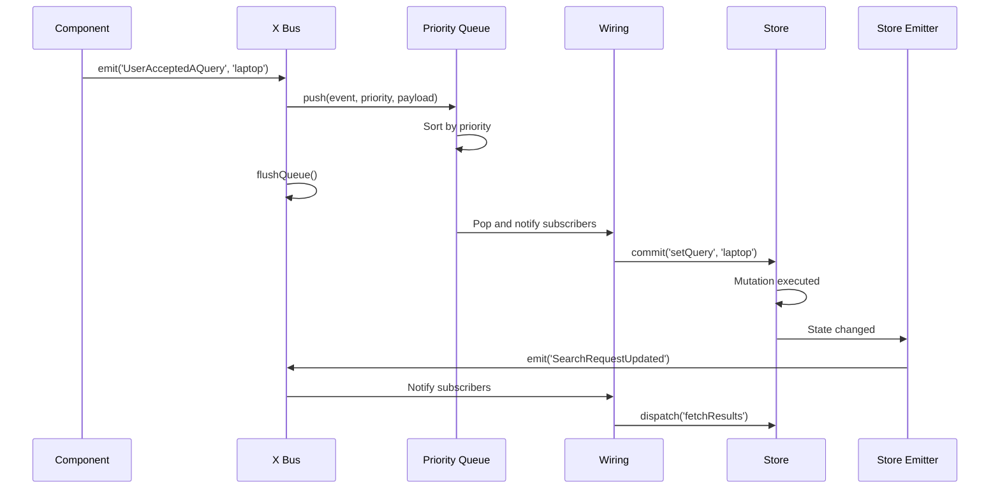

At the heart of Interface X is a powerful event-driven architecture powered by the **X Bus** - a priority-based event bus built on RxJS that enables reactive, loosely-coupled communication between modules.

## The X Bus

The X Bus is an implementation of the event bus pattern that manages event emission and subscription across the entire application:

```typescript
// From: x-bus/x-bus.types.ts
export interface XBus<SomeEvents extends Dictionary, SomeEventMetadata extends Dictionary> {
  /**
   * Emits an event with optional payload
   */
  emit: <SomeEvent extends keyof SomeEvents>(
    event: SomeEvent,
    payload?: EventPayload<SomeEvents, SomeEvent>,
    metadata?: SomeEventMetadata,
  ) => Promise<EmittedData<SomeEvents, SomeEvent, SomeEventMetadata>>

  /**
   * Retrieves an observable for an event
   */
  on: <SomeEvent extends keyof SomeEvents>(
    event: SomeEvent,
    withMetadata?: boolean,
  ) => Observable<EventPayload<SomeEvents, SomeEvent>>
}
```

<Info>
  The X Bus uses **RxJS observables** under the hood, giving you the full power of reactive programming with operators like `map`, `filter`, `debounce`, and more.
</Info>

## Event Priority System

Unlike simple event buses, the X Bus implements a **priority queue** to control event processing order:

```typescript
// From: x-bus/x-bus.ts
export class XPriorityBus<
  SomeEvents extends Dictionary,
  SomeEventMetadata extends XPriorityBusEventMetadata,
> implements XBus<SomeEvents, SomeEventMetadata> {
  protected queue: XPriorityQueue<SomeEvents, XPriorityQueueNodeData>
  protected priorities: Dictionary<Priority>
  protected defaultEventPriority: number
  
  emit<SomeEvent extends keyof SomeEvents>(
    event: SomeEvent,
    payload?: EventPayload<SomeEvents, SomeEvent>,
    metadata = {} as SomeEventMetadata,
  ): Promise<EmittedData<SomeEvents, SomeEvent, SomeEventMetadata>> {
    return new Promise(resolve => {
      this.queue.push(event, this.getEventPriority(event, metadata), {
        eventPayload: payload,
        eventMetadata: metadata,
        replaceable: metadata.replaceable || false,
        resolve,
      })
      this.flushQueue()
    })
  }
}
```

### How Priority Works

<Steps>
  <Step title="Event Emitted">
    When an event is emitted, it's added to a priority queue, not immediately dispatched
  </Step>
  
  <Step title="Priority Calculated">
    Priority is determined by:
    1. Explicit `metadata.priority` value
    2. Event name pattern matching (e.g., events with "User" prefix)
    3. Default priority (minimum safe integer)
  </Step>
  
  <Step title="Queue Flushed">
    Events are processed from the queue in priority order (highest first)
  </Step>
  
  <Step title="Subscribers Notified">
    All subscribers receive the event payload through their observables
  </Step>
</Steps>

```typescript
// Configure priorities
const bus = new XPriorityBus({
  priorities: {
    '^User': 100,        // User events have high priority
    'Response': 50,      // Response events medium
    'Changed': 10,       // Change events lower
  },
  defaultEventPriority: 0,
})
```

## Event Types

All events in Interface X are strongly typed through the `XEventsTypes` interface:

```typescript
// From: wiring/events.types.ts
export interface XEventsTypes
  extends DeviceXEvents,
    SearchXEvents,
    FacetsXEvents,
    QuerySuggestionsXEvents,
    // ... all module events
{
  /**
   * The user has accepted a query
   * Payload: the accepted query string
   */
  UserAcceptedAQuery: string
  
  /**
   * The user has clicked on a result
   * Payload: The result that the user clicked
   */
  UserClickedAResult: Result
  
  /**
   * The search response has changed
   * Payload: The search response data
   */
  SearchResponseChanged: SearchResponse
  
  /**
   * A new XModule has been registered
   * Payload: The name of the XModule
   */
  ModuleRegistered: XModuleName
  
  // ... 100+ events
}

export type XEvent = keyof XEventsTypes
```

<Tip>
  Browse the `XEventsTypes` interface to see all available events. Each module contributes its own event types.
</Tip>

### Module-Specific Events

Each module defines its own events:

```typescript
// From: x-modules/search/events.types.ts
export interface SearchXEvents {
  /**
   * The search request parameters have been updated.
   * Payload: The internal search request.
   */
  SearchRequestUpdated: InternalSearchRequest | null
  
  /**
   * The search request parameters have been changed.
   * Payload: The internal search request.
   */
  SearchRequestChanged: InternalSearchRequest | null
  
  /**
   * The search results have changed.
   * Payload: The search response changed information.
   */
  SearchResponseChanged: SearchResponseChanged
  
  /**
   * The search results have changed.
   * Payload: The new results list.
   */
  ResultsChanged: Result[]
  
  // ... more events
}
```

## Event Metadata

Events carry metadata alongside their payload:

```typescript
// From: wiring/wiring.types.ts
export interface WireMetadata {
  /** The QueryFeature that originated the event */
  feature?: QueryFeature | ResultFeature
  
  /** The id of the component origin */
  id?: string
  
  /** The FeatureLocation from where the event has been emitted */
  location?: FeatureLocation
  
  /** The XModule name that emitted the event or null */
  moduleName: XModuleName | null
  
  /** The old value of a watched selector triggering an emitter */
  oldValue?: unknown
  
  /** The DOM element that triggered the event emission */
  target?: HTMLElement
  
  /** The component instance that triggered the event emission */
  component?: Component
  
  /** The event priority for queue sorting */
  priority?: Priority
  
  /** The event replaces an existing entry in the bus */
  replaceable?: boolean
  
  /** Modules that should ignore this event */
  ignoreInModules?: XModuleName[]
  
  [key: string]: unknown
}
```

<CodeGroup>
```typescript Emitting with Metadata
// Emit with priority
await XPlugin.bus.emit('UserAcceptedAQuery', 'laptop', {
  priority: 100,
  feature: 'search_box',
  moduleName: 'searchBox',
})

// Replaceable event (replaces previous if still in queue)
await XPlugin.bus.emit('QueryChanged', 'laptop', {
  replaceable: true,
})
```

```typescript Accessing Metadata in Wires
import { createWireFromFunction } from '@empathyco/x-components/wiring'

const myWire = createWireFromFunction(({ eventPayload, metadata, store }) => {
  console.log('Event from:', metadata.moduleName)
  console.log('Feature:', metadata.feature)
  console.log('Priority:', metadata.priority)
  console.log('Payload:', eventPayload)
})
```
</CodeGroup>

## Emitting Events

### From Components

Components emit events using the `$x` API:

```vue
<template>
  <button @click="handleClick">Search</button>
</template>

<script>
export default {
  methods: {
    handleClick() {
      // Emit event through $x API
      this.$x.emit('UserAcceptedAQuery', this.query)
    },
  },
}
</script>
```

### From Outside Components

Access the bus directly from XPlugin:

```typescript
import { XPlugin } from '@empathyco/x-components'

// Emit an event
await XPlugin.bus.emit('UserAcceptedAQuery', 'laptop')

// Emit with metadata
await XPlugin.bus.emit('UserClickedAResult', result, {
  feature: 'search',
  location: 'results',
})
```

### From Store Emitters

Store emitters automatically emit events when state changes:

```typescript
// When state.results changes, ResultsChanged is emitted
ResultsChanged: state => state.results
```

## Subscribing to Events

### In Wiring

Wires automatically subscribe to events:

```typescript
const searchWiring = createWiring({
  // Wire subscribes to UserAcceptedAQuery
  UserAcceptedAQuery: {
    setSearchQuery: wireCommit('setQuery'),
  },
})
```

### Using Observables

Access the raw observable for advanced use cases:

```typescript
import { XPlugin } from '@empathyco/x-components'

// Get observable for an event
const results$ = XPlugin.bus.on('ResultsChanged')

// Subscribe with RxJS operators
results$
  .pipe(
    filter(results => results.length > 0),
    map(results => results.slice(0, 10)),
    debounceTime(300),
  )
  .subscribe(results => {
    console.log('Top 10 results:', results)
  })
```

### With Metadata

Subscribe to events with their metadata:

```typescript
const results$ = XPlugin.bus.on('ResultsChanged', true)

results$.subscribe(({ eventPayload, metadata }) => {
  console.log('Results:', eventPayload)
  console.log('From module:', metadata.moduleName)
  console.log('Old value:', metadata.oldValue)
})
```

## Wiring System

The wiring system connects events to actions in a declarative way:

```typescript
// From: x-modules/search/wiring.ts
export const searchWiring = createWiring({
  // Multiple wires can respond to one event
  UserAcceptedAQuery: {
    setSearchQuery: wireCommit('setQuery'),
    saveOriginWire: wireDispatch('saveOrigin', ({ metadata }) => metadata),
  },
  
  // One wire per event
  SearchRequestUpdated: {
    fetchAndSaveSearchResponseWire: wireDispatch('fetchAndSaveSearchResponse'),
  },
  
  // Wires with no payload
  UserClearedQuery: {
    cancelFetchWire: wireDispatchWithoutPayload('cancelFetchAndSaveSearchResponse'),
  },
})
```

### Wire Factories

Interface X provides factories for creating wires:

<CodeGroup>
```typescript Wire Commit
import { wireCommit, wireCommitWithoutPayload } from '@empathyco/x-components/wiring'

// Commit with event payload
const setQuery = wireCommit('x/search/setQuery')

// Commit with static value
const clearQuery = wireCommit('x/search/setQuery', '')

// Commit with computed value
const setUpperQuery = wireCommit(
  'x/search/setQuery',
  ({ eventPayload }) => eventPayload.toUpperCase()
)

// Commit without payload
const resetState = wireCommitWithoutPayload('x/search/resetState')
```

```typescript Wire Dispatch
import { wireDispatch, wireDispatchWithoutPayload } from '@empathyco/x-components/wiring'

// Dispatch with event payload
const fetchResults = wireDispatch('x/search/fetchAndSaveSearchResponse')

// Dispatch with static value
const fetchWithParams = wireDispatch('x/search/fetchResults', { page: 1 })

// Dispatch with computed value
const fetchWithMetadata = wireDispatch(
  'x/search/fetchResults',
  ({ eventPayload, metadata }) => ({
    query: eventPayload,
    origin: metadata.feature,
  })
)

// Dispatch without payload
const cancelFetch = wireDispatchWithoutPayload('x/search/cancelFetch')
```

```typescript Custom Wire
import { createWireFromFunction } from '@empathyco/x-components/wiring'

const customWire = createWireFromFunction(({ eventPayload, store, metadata }) => {
  // Custom logic
  console.log('Event received:', eventPayload)
  
  // Access store
  const state = store.state.x.search
  
  // Commit/dispatch
  store.commit('x/search/setQuery', eventPayload)
  store.dispatch('x/search/fetchResults')
})
```
</CodeGroup>

### Namespaced Wire Helpers

Create namespaced wires for cleaner code:

```typescript
import { 
  namespacedWireCommit,
  namespacedWireDispatch 
} from '@empathyco/x-components/wiring'

const moduleName = 'search'

// Create namespaced helpers
const wireCommit = namespacedWireCommit(moduleName)
const wireDispatch = namespacedWireDispatch(moduleName)

// Use without module prefix
const setQuery = wireCommit('setQuery')  // Commits to x/search/setQuery
const fetchResults = wireDispatch('fetchAndSaveSearchResponse')
```

## Event Flow Visualization

Here's how events flow through the system:



## Event Debugging

### Vue Devtools Integration

Interface X integrates with Vue Devtools to show:
- All emitted events
- Event payloads and metadata
- Wiring subscriptions
- Module relationships

### Console Logging

Log all events for debugging:

```typescript
app.use(xPlugin, {
  adapter: platformAdapter,
  // Pass emit callbacks
  __PRIVATE__: {
    emitCallbacks: [
      (event, payload) => {
        console.log('Event:', event, payload)
      },
    ],
  },
})
```

## Best Practices

<AccordionGroup>
  <Accordion title="Use Descriptive Event Names">
    Event names should be clear and follow the pattern `SubjectVerbObject`:
    - ✅ `UserAcceptedAQuery`
    - ✅ `SearchResponseChanged`
    - ❌ `Query`
    - ❌ `Update`
  </Accordion>

  <Accordion title="Keep Payloads Simple">
    Event payloads should be serializable and focused:
    - ✅ Pass data objects
    - ✅ Pass primitive values
    - ❌ Pass Vue components
    - ❌ Pass circular references
  </Accordion>

  <Accordion title="Use Metadata for Context">
    Use metadata for contextual information:
    - Source module/component
    - Priority hints
    - Feature tags
    - UI locations
  </Accordion>

  <Accordion title="Avoid Event Chains">
    Don't create long chains of events triggering events:
    - ✅ Component → Event → Action → State Update → Event
    - ❌ Event → Event → Event → Event → ...
  </Accordion>
</AccordionGroup>

## Next Steps

<CardGroup cols={2}>
  <Card title="State Management" icon="database" href="./state-management">
    Learn how state is managed in Vuex stores
  </Card>
  
  <Card title="X Modules" icon="boxes" href="./x-modules">
    Understand how modules use events to communicate
  </Card>
</CardGroup>