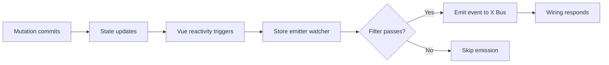

Interface X uses **Vuex** for centralized state management, with each X Module having its own namespaced store module. The entire system is fully type-safe, providing autocomplete and compile-time error checking throughout.

## Store Architecture

All module stores are registered under a root `x` namespace for clean scoping:

```typescript
// From: store/store.types.ts
export interface RootXStoreState {
  x: {
    [Module in XModuleName]: ExtractState<Module>
  }
}

// Actual state structure:
{
  x: {
    search: { query: '', results: [], ... },
    facets: { facets: [], selectedFilters: [], ... },
    searchBox: { query: '', ... },
    // ... all modules
  }
}
```

<Info>
  The `x` namespace prevents conflicts with your own Vuex modules and makes it clear which state belongs to Interface X.
</Info>

## Type-Safe Store Modules

Each module's store is strongly typed using the `XStoreModule` interface:

```typescript
// From: store/store.types.ts
export interface XStoreModule<
  State extends Record<keyof State, any>,
  Getters extends Record<keyof Getters, any>,
  Mutations extends MutationsDictionary<Mutations>,
  Actions extends ActionsDictionary<Actions>,
> {
  actions: ActionsTree<State, Getters, Mutations, Actions>
  getters: GettersTree<State, Getters>
  mutations: MutationsTree<State, Mutations>
  state: () => State
}
```

### Example: Search Module Store

Let's examine the real search module store from the source:

```typescript
// From: x-modules/search/store/module.ts
export const searchXStoreModule: SearchXStoreModule = {
  state: () => ({
    // Resettable state
    query: '',
    results: [],
    partialResults: [],
    facets: [],
    relatedTags: [],
    banners: [],
    promoteds: [],
    totalResults: 0,
    spellcheckedQuery: '',
    sort: '',
    page: 1,
    origin: null,
    isAppendResults: false,
    redirections: [],
    queryTagging: { url: '', params: {} },
    displayTagging: { url: '', params: {} },
    stats: {} as Stats,
    
    // Persistent state
    selectedFilters: {},
    params: {},
    config: {
      pageSize: 24,
      pageMode: 'infinite_scroll',
    },
    status: 'initial',
    isNoResults: false,
    fromNoResultsWithFilters: false,
  }),
  
  getters: {
    request,  // Computed search request
    query,    // Current query
  },
  
  mutations: {
    appendResults(state, results) {
      state.results = [...state.results, ...results]
    },
    resetState(state) {
      Object.assign(state, resettableState())
    },
    setQuery,
    setResults(state, results) {
      state.results = results
    },
    setFacets(state, facets) {
      state.facets = facets
    },
    // ... 20+ more mutations
  },
  
  actions: {
    cancelFetchAndSaveSearchResponse,
    fetchSearchResponse,
    fetchAndSaveSearchResponse,
    increasePageAppendingResults,
    resetRequestOnRefinement,
    saveSearchResponse,
    setUrlParams,
    saveOrigin,
  },
}
```

<Accordion title="View State Type Definition">
```typescript
interface SearchState {
  query: string
  results: Result[]
  partialResults: PartialResult[]
  facets: Facet[]
  relatedTags: RelatedTag[]
  banners: Banner[]
  promoteds: Promoted[]
  totalResults: number
  spellcheckedQuery: string
  sort: string
  page: number
  origin: Origin | null
  isAppendResults: boolean
  selectedFilters: Dictionary<Filter[]>
  params: Dictionary<unknown>
  config: SearchConfig
  status: Status
  isNoResults: boolean
  fromNoResultsWithFilters: boolean
  redirections: Redirection[]
  queryTagging: TaggingInfo
  displayTagging: TaggingInfo
  stats: Stats
}
```
</Accordion>

## State Access

### From Components

Access state using Vuex's `mapState` or `computed` properties:

```vue
<template>
  <div>
    <p>Query: {{ query }}</p>
    <p>Results: {{ results.length }}</p>
  </div>
</template>

<script>
import { mapState } from 'vuex'

export default {
  computed: {
    ...mapState('x/search', ['query', 'results']),
    
    // Or manually
    query() {
      return this.$store.state.x.search.query
    },
  },
}
</script>
```

<Tip>
  Use the `useState` composable in Composition API for reactive state access.
</Tip>

### From Store Actions

Actions receive context with typed state access:

```typescript
actions: {
  async fetchAndSaveSearchResponse({ state, commit, dispatch, getters }) {
    // Access state
    const { query, page } = state
    
    // Access getters
    const request = getters.request
    
    // Commit mutations
    commit('setStatus', 'loading')
    
    // Call other actions
    await dispatch('saveSearchResponse', response)
  },
}
```

## Getters

Getters compute derived state from the store:

```typescript
// From: x-modules/search/store/getters/request.getter.ts
export const request: SearchGetter<InternalSearchRequest | null> = (
  state,
  getters,
) => {
  // Only return request if query is not empty
  if (!state.query) {
    return null
  }
  
  return {
    query: state.query,
    rows: state.config.pageSize,
    start: (state.page - 1) * state.config.pageSize,
    filters: Object.values(state.selectedFilters).flat(),
    sort: state.sort,
    extraParams: state.params,
  }
}
```

### Accessing Getters

<CodeGroup>
```vue From Components
<template>
  <div>
    <p>{{ searchRequest }}</p>
  </div>
</template>

<script>
import { mapGetters } from 'vuex'

export default {
  computed: {
    ...mapGetters('x/search', ['request']),
    
    // Or use namespace helpers
    ...mapGetters('x/search', {
      searchRequest: 'request',
    }),
  },
}
</script>
```

```typescript From Actions
actions: {
  async myAction({ getters }) {
    const request = getters.request
    console.log('Current request:', request)
  },
}
```

```typescript Type-Safe Access
import type { ExtractGetters } from '@empathyco/x-components'

// Extract getter types for a module
type SearchGetters = ExtractGetters<'search'>

// SearchGetters = {
//   request: InternalSearchRequest | null
//   query: string
// }
```
</CodeGroup>

## Mutations

Mutations are the **only** way to modify state. They must be synchronous:

```typescript
mutations: {
  // Simple mutation
  setQuery(state, query: string) {
    state.query = query
  },
  
  // Mutation with object payload
  setResults(state, results: Result[]) {
    state.results = results
  },
  
  // Mutation modifying nested state
  setSelectedFilters(state, selectedFilters: Filter[]) {
    state.selectedFilters = groupItemsBy(
      selectedFilters,
      filter => isFacetFilter(filter) ? filter.facetId : UNKNOWN_FACET_KEY
    )
  },
  
  // Mutation resetting state
  resetState(state) {
    Object.assign(state, resettableState())
  },
  
  // Conditional reset
  resetStateForReload(state) {
    const { query, facets, sort, page, ...resettable } = resettableState()
    Object.assign(state, resettable)
  },
}
```

### Committing Mutations

<CodeGroup>
```typescript From Wiring
import { wireCommit } from '@empathyco/x-components/wiring'

const searchWiring = createWiring({
  UserAcceptedAQuery: {
    setSearchQuery: wireCommit('x/search/setQuery'),
  },
})
```

```typescript From Actions
actions: {
  async myAction({ commit }) {
    commit('setQuery', 'laptop')
    commit('setStatus', 'loading')
  },
}
```

```typescript From Components
export default {
  methods: {
    updateQuery(query) {
      this.$store.commit('x/search/setQuery', query)
    },
  },
}
```
</CodeGroup>

<Warning>
  **Never** mutate state directly outside of mutations. Always use `commit()` to ensure reactivity and enable time-travel debugging.
</Warning>

## Actions

Actions handle asynchronous operations and can commit multiple mutations:

```typescript
// From: x-modules/search/store/actions/fetch-and-save-search-response.action.ts
export const fetchAndSaveSearchResponse: SearchAction<
  'fetchAndSaveSearchResponse',
  void
> = async ({ state, commit, dispatch, getters }) => {
  const request = getters.request
  
  if (!request) {
    return
  }
  
  commit('setStatus', 'loading')
  
  try {
    const response = await XPlugin.adapter.search(request)
    
    if (state.isAppendResults) {
      commit('appendResults', response.results)
    } else {
      commit('setResults', response.results)
    }
    
    commit('setFacets', response.facets)
    commit('setTotalResults', response.totalResults)
    commit('setBanners', response.banners)
    commit('setPromoteds', response.promoteds)
    commit('setSpellcheck', response.spellcheck)
    commit('setStatus', 'success')
    
  } catch (error) {
    commit('setStatus', 'error')
    throw error
  }
}
```

### Action Composition

Actions can call other actions:

```typescript
actions: {
  async increasePageAppendingResults({ state, commit, dispatch }) {
    commit('setIsAppendResults', true)
    commit('setPage', state.page + 1)
    
    // Dispatch another action
    await dispatch('fetchAndSaveSearchResponse')
  },
  
  async setUrlParams({ commit, dispatch }, params) {
    commit('setQuery', params.query)
    commit('setPage', params.page ?? 1)
    commit('setSort', params.sort ?? '')
    
    // Fetch with new params
    await dispatch('fetchAndSaveSearchResponse')
  },
}
```

### Dispatching Actions

<CodeGroup>
```typescript From Wiring
import { wireDispatch } from '@empathyco/x-components/wiring'

const searchWiring = createWiring({
  SearchRequestUpdated: {
    fetchAndSaveSearchResponseWire: wireDispatch(
      'x/search/fetchAndSaveSearchResponse'
    ),
  },
})
```

```typescript From Components
export default {
  async mounted() {
    await this.$store.dispatch('x/search/fetchAndSaveSearchResponse')
  },
}
```

```typescript From Other Actions
actions: {
  async myAction({ dispatch }) {
    await dispatch('x/search/fetchAndSaveSearchResponse')
  },
}
```
</CodeGroup>

## Store Emitters

Store emitters watch state changes and emit events automatically:

```typescript
// From: x-modules/search/store/emitters.ts
export const searchEmitters = createStoreEmitters(searchXStoreModule, {
  // Simple emitter - emits when results change
  ResultsChanged: state => state.results,
  
  // Emitter using getters
  SearchRequestUpdated: (_, getters) => getters.request,
  
  // Emitter with filter
  FacetsChanged: {
    selector: state => state.facets,
    filter(newValue, oldValue) {
      // Only emit if there are facets or there were facets
      return newValue.length !== 0 || oldValue.length !== 0
    },
  },
  
  // Complex emitter
  SearchResponseChanged: {
    selector: (state, getters) => ({
      request: getters.request!,
      status: state.status,
      banners: state.banners,
      facets: state.facets,
      partialResults: state.partialResults,
      promoteds: state.promoteds,
      queryTagging: state.queryTagging,
      displayTagging: state.displayTagging,
      redirections: state.redirections,
      results: state.results,
      spellcheck: state.spellcheckedQuery,
      totalResults: state.totalResults,
    }),
    filter: (newValue, oldValue) => {
      // Only emit when loading is complete
      return (
        newValue.status !== oldValue.status &&
        oldValue.status === 'loading' &&
        !!newValue.request
      )
    },
  },
  
  // Emitter with metadata
  SearchTaggingChanged: {
    selector: state => state.queryTagging,
    filter: ({ url }) => !isStringEmpty(url),
    metadata: {
      moduleName: 'search',
    },
  },
})
```

<Info>
  Store emitters create the **reactive bridge** between Vuex state and the event bus. They're registered automatically when a module is installed.
</Info>

### How Emitters Work



## Type Extraction Utilities

Interface X provides utilities to extract types from modules:

```typescript
import type {
  ExtractState,
  ExtractGetters,
  ExtractMutations,
  ExtractActions,
  ExtractMutationPayload,
  ExtractActionPayload,
} from '@empathyco/x-components'

// Extract state type
type SearchState = ExtractState<'search'>

// Extract getters type
type SearchGetters = ExtractGetters<'search'>

// Extract mutations type
type SearchMutations = ExtractMutations<SearchXModule>

// Extract actions type
type SearchActions = ExtractActions<SearchXModule>

// Extract specific mutation payload
type SetQueryPayload = ExtractMutationPayload<'search', 'setQuery'>
// Result: string

// Extract specific action payload
type FetchPayload = ExtractActionPayload<'search', 'fetchAndSaveSearchResponse'>
// Result: void
```

## Store Configuration

Configure module stores when installing XPlugin:

```typescript
import { createApp } from 'vue'
import { xPlugin } from '@empathyco/x-components'
import { createStore } from 'vuex'

const app = createApp(App)

// Option 1: Let XPlugin create the store
app.use(xPlugin, {
  adapter: platformAdapter,
  xModules: {
    search: {
      config: {
        pageSize: 48,
        pageMode: 'paginated',
      },
    },
  },
})

// Option 2: Provide your own store
const myStore = createStore({
  // Your modules
})

app.use(xPlugin, {
  adapter: platformAdapter,
  store: myStore,  // X modules will be registered under 'x' namespace
})
```

## Resettable State Pattern

The search module demonstrates a useful pattern for resetting state:

```typescript
// Define resettable state as a function
function resettableState() {
  return {
    query: '',
    results: [],
    partialResults: [],
    // ... more fields that should reset
  }
}

export const searchXStoreModule = {
  state: () => ({
    ...resettableState(),
    // Persistent fields that don't reset
    selectedFilters: {},
    config: { pageSize: 24 },
  }),
  
  mutations: {
    // Full reset
    resetState(state) {
      Object.assign(state, resettableState())
    },
    
    // Partial reset (keep some fields)
    resetStateForReload(state) {
      const { query, facets, sort, page, ...resettable } = resettableState()
      Object.assign(state, resettable)
    },
  },
}
```

<Tip>
  Use this pattern when you need to reset parts of your state while keeping other parts intact (like user preferences or config).
</Tip>

## Accessing Root State

While modules should be self-contained, you can access root state when needed:

```typescript
actions: {
  async myAction({ rootState, rootGetters }) {
    // Access other module state
    const facets = rootState.x.facets.facets
    const searchQuery = rootState.x.search.query
    
    // Access other module getters
    const searchRequest = rootGetters['x/search/request']
  },
}
```

<Warning>
  Accessing other module state creates coupling. Prefer communicating through events instead.
</Warning>

## Best Practices

<AccordionGroup>
  <Accordion title="Keep Mutations Simple">
    Mutations should only modify state, not contain business logic:
    - ✅ `state.query = query`
    - ✅ `state.results = results`
    - ❌ API calls
    - ❌ Complex computations
    - ❌ Emitting events
  </Accordion>

  <Accordion title="Use Actions for Async Logic">
    All asynchronous operations belong in actions:
    - ✅ API calls
    - ✅ Multiple mutation commits
    - ✅ Dispatching other actions
    - ✅ Complex business logic
  </Accordion>

  <Accordion title="Leverage Getters for Computed State">
    Don't duplicate state - compute it in getters:
    - ✅ `totalItems: state => state.items.length`
    - ✅ `filteredItems: state => state.items.filter(...)`
    - ❌ Storing derived data in state
  </Accordion>

  <Accordion title="Type Everything">
    Take advantage of TypeScript:
    - ✅ Define state interfaces
    - ✅ Type mutation payloads
    - ✅ Type action payloads
    - ✅ Use type extraction utilities
  </Accordion>
</AccordionGroup>

## Next Steps

<CardGroup cols={2}>
  <Card title="Architecture Overview" icon="sitemap" href="./architecture">
    See how stores fit into the overall architecture
  </Card>
  
  <Card title="Event System" icon="bolt" href="./event-system">
    Learn how stores emit events automatically
  </Card>
</CardGroup>