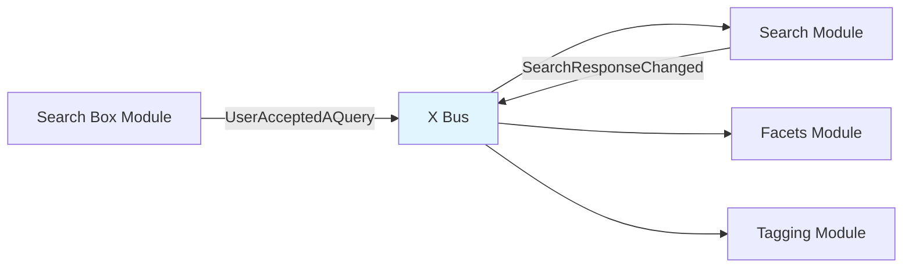

X Modules are the fundamental building blocks of Interface X. Each module encapsulates a complete feature - including its state management, event handling, and UI components - into a self-contained, reusable unit.

## What is an X Module?

An X Module is a TypeScript object that brings together four key pieces:

```typescript
export interface XModule<StoreModule extends AnyXStoreModule> {
  /** A unique name that identifies this XModule */
  name: XModuleName
  
  /** Watchers for the store module that will emit an XEvent when changed */
  storeEmitters: StoreEmitters<StoreModule>
  
  /** The Vuex Store module associated to this module */
  storeModule: StoreModule
  
  /** The wiring associated to this module */
  wiring: Partial<Wiring>
}
```

<Note>
  Every X Module must have these four properties. Together, they define the module's complete behavior.
</Note>

## Module Structure

Let's examine the search module as a real example from the codebase:

```
x-modules/search/
├── components/          # Vue components for this module
│   ├── SearchInput.vue
│   ├── ResultsList.vue
│   └── ...
├── store/              # Vuex store module
│   ├── module.ts       # State, mutations, actions, getters
│   ├── emitters.ts     # Store emitters configuration
│   ├── actions/        # Action implementations
│   ├── getters/        # Getter implementations
│   └── types.ts        # TypeScript types
├── wiring.ts           # Event wiring configuration
├── events.types.ts     # Module-specific event types
├── config.types.ts     # Configuration options
└── x-module.ts         # Module definition and registration
```

### Module Definition

Here's the actual search module definition from the source code:

```typescript
// x-modules/search/x-module.ts
import type { XModule } from '../x-modules.types'
import type { SearchXStoreModule } from './store/types'
import { XPlugin } from '../../plugins/x-plugin'
import { searchEmitters } from './store/emitters'
import { searchXStoreModule } from './store/module'
import { searchWiring } from './wiring'

export type SearchXModule = XModule<SearchXStoreModule>

export const searchXModule: SearchXModule = {
  name: 'search',
  storeModule: searchXStoreModule,
  storeEmitters: searchEmitters,
  wiring: searchWiring,
}

// Auto-register on import
XPlugin.registerXModule(searchXModule)
```

<Warning>
  The `XPlugin.registerXModule()` call at the bottom is crucial - it auto-registers the module when any component from it is imported.
</Warning>

## Available X Modules

Interface X ships with 22 built-in modules covering all aspects of search and discovery:

<AccordionGroup>
  <Accordion title="Core Search Modules">
    - **search** - Main search functionality, results, and pagination
    - **search-box** - Search input with query handling
    - **facets** - Filtering with hierarchical and range facets
    - **query-suggestions** - Autocomplete suggestions as users type
  </Accordion>

  <Accordion title="Discovery Modules">
    - **popular-searches** - Trending and popular queries
    - **recommendations** - Product recommendations
    - **next-queries** - Related searches and query refinement
    - **related-tags** - Tag-based navigation
    - **semantic-queries** - Semantic search capabilities
    - **related-prompts** - AI-driven query prompts
  </Accordion>

  <Accordion title="User Experience Modules">
    - **empathize** - Combined empathy layer (suggestions, popular searches, etc.)
    - **history-queries** - Search history management
    - **identifier-results** - Product identification
    - **queries-preview** - Preview results for queries
  </Accordion>

  <Accordion title="Support Modules">
    - **scroll** - Infinite scroll and pagination
    - **url** - URL parameter synchronization
    - **tagging** - Analytics and tracking
    - **experience-controls** - A/B testing and personalization
    - **extra-params** - Additional request parameters
    - **device** - Device detection
    - **ai** - AI-powered features
  </Accordion>
</AccordionGroup>

## Module Anatomy Deep Dive

### 1. Store Module

Each module has a type-safe Vuex store module:

```typescript
// From: x-modules/search/store/module.ts
export const searchXStoreModule: SearchXStoreModule = {
  state: () => ({
    query: '',
    results: [],
    facets: [],
    totalResults: 0,
    page: 1,
    sort: '',
    status: 'initial',
    config: {
      pageSize: 24,
      pageMode: 'infinite_scroll',
    },
    // ... more state
  }),
  
  getters: {
    request(state, getters) {
      // Compute search request from state
    },
    query(state) {
      return state.query
    },
  },
  
  mutations: {
    setQuery(state, query) {
      state.query = query
    },
    setResults(state, results) {
      state.results = results
    },
    // ... more mutations
  },
  
  actions: {
    async fetchAndSaveSearchResponse({ state, commit, dispatch }) {
      commit('setStatus', 'loading')
      const response = await adapter.search(/* ... */)
      commit('setResults', response.results)
      commit('setStatus', 'success')
    },
    // ... more actions
  },
}
```

<Info>
  All module stores are automatically namespaced under `x.[moduleName]` when registered. For example, the search state is at `store.state.x.search`.
</Info>

### 2. Store Emitters

Store emitters watch for state changes and emit events:

```typescript
// From: x-modules/search/store/emitters.ts
export const searchEmitters = createStoreEmitters(searchXStoreModule, {
  // Emit when results change
  ResultsChanged: state => state.results,
  
  // Emit when search request is updated
  SearchRequestUpdated: (_, getters) => getters.request,
  
  // Emit with custom filter
  SearchResponseChanged: {
    selector: (state, getters) => ({
      request: getters.request,
      status: state.status,
      results: state.results,
      facets: state.facets,
      totalResults: state.totalResults,
    }),
    filter: (newValue, oldValue) => {
      // Only emit when response has finished loading
      return newValue.status !== oldValue.status && 
             oldValue.status === 'loading'
    },
  },
  
  // More emitters...
})
```

<Tip>
  Store emitters create a **reactive bridge** between your Vuex state and the event system. When state changes, events are automatically emitted.
</Tip>

### 3. Wiring

Wiring connects events to actions:

```typescript
// From: x-modules/search/wiring.ts
export const searchWiring = createWiring({
  // When user accepts a query
  UserAcceptedAQuery: {
    setSearchQuery: wireCommit('setQuery'),
    saveOriginWire: wireDispatch('saveOrigin', ({ metadata }) => metadata),
  },
  
  // When search request is updated
  SearchRequestUpdated: {
    resetStateIfNoRequestWire: filterTruthyPayload(
      wireCommitWithoutPayload('resetState')
    ),
    fetchAndSaveSearchResponseWire: wireDispatch('fetchAndSaveSearchResponse'),
  },
  
  // When user clears the query
  UserClearedQuery: {
    setSearchQuery: wireCommit('setQuery', ''),
    cancelFetchAndSaveSearchResponseWire: wireDispatchWithoutPayload(
      'cancelFetchAndSaveSearchResponse'
    ),
  },
  
  // When user reaches end of results
  UserReachedResultsListEnd: {
    increasePageAppendingResultsWire: wireDispatchWithoutPayload(
      'increasePageAppendingResults'
    ),
  },
  
  // ... more wiring
})
```

<CodeGroup>
```typescript Wire Commit
// Commits a mutation
wireCommit('setQuery')

// Commits with static payload
wireCommit('setQuery', '')

// Commits with computed payload
wireCommit('setQuery', ({ eventPayload }) => eventPayload.toUpperCase())
```

```typescript Wire Dispatch
// Dispatches an action
wireDispatch('fetchAndSaveSearchResponse')

// Dispatches with static payload
wireDispatch('saveOrigin', null)

// Dispatches with computed payload
wireDispatch('saveOrigin', ({ metadata }) => metadata)
```
</CodeGroup>

### 4. Module Name

All module names are defined in a central type:

```typescript
// From: x-modules/x-modules.types.ts
export interface XModulesTree {
  device: DeviceXModule
  empathize: EmpathizeXModule
  extraParams: ExtraParamsXModule
  facets: FacetsXModule
  historyQueries: HistoryQueriesXModule
  identifierResults: IdentifierResultsXModule
  nextQueries: NextQueriesXModule
  popularSearches: PopularSearchesXModule
  queriesPreview: QueriesPreviewXModule
  querySuggestions: QuerySuggestionsXModule
  recommendations: RecommendationsXModule
  relatedPrompts: RelatedPromptsXModule
  relatedTags: RelatedTagsXModule
  scroll: ScrollXModule
  search: SearchXModule
  searchBox: SearchBoxXModule
  semanticQueries: SemanticQueriesXModule
  tagging: TaggingXModule
  url: UrlXModule
  experienceControls: ExperienceControlsXModule
  ai: AiXModule
}

export type XModuleName = keyof XModulesTree
```

## Module Communication

Modules never communicate directly - they **only communicate through events**:



<Steps>
  <Step title="Search Box emits event">
    User types in search box, which emits `UserAcceptedAQuery` event
  </Step>
  
  <Step title="Search module responds">
    Search module's wiring reacts to the event and fetches results
  </Step>
  
  <Step title="Search emits response event">
    Store emitter automatically emits `SearchResponseChanged` event
  </Step>
  
  <Step title="Other modules respond">
    Facets, tagging, and other modules can react to the response event
  </Step>
</Steps>

This approach has major benefits:

<CardGroup cols={2}>
  <Card title="Zero Coupling" icon="unlink">
    Modules don't import or reference each other
  </Card>
  
  <Card title="Easy Testing" icon="flask">
    Test modules in isolation by emitting events
  </Card>
  
  <Card title="Hot Swapping" icon="rotate">
    Replace or disable modules without affecting others
  </Card>
  
  <Card title="Extensibility" icon="plus">
    Add custom modules that listen to existing events
  </Card>
</CardGroup>

## Creating a Custom Module

You can create your own X Module following the same pattern:

```typescript
import { XPlugin } from '@empathyco/x-components'
import type { XModule } from '@empathyco/x-components/x-modules'

// 1. Define your store module
const myStoreModule = {
  state: () => ({ items: [] }),
  getters: { /* ... */ },
  mutations: { /* ... */ },
  actions: { /* ... */ },
}

// 2. Define store emitters
const myEmitters = createStoreEmitters(myStoreModule, {
  ItemsChanged: state => state.items,
})

// 3. Define wiring
const myWiring = createWiring({
  UserClickedSomething: {
    doSomething: wireDispatch('fetchItems'),
  },
})

// 4. Create and register module
const myCustomModule: XModule<typeof myStoreModule> = {
  name: 'myCustomModule',
  storeModule: myStoreModule,
  storeEmitters: myEmitters,
  wiring: myWiring,
}

XPlugin.registerXModule(myCustomModule)
```

<Warning>
  Custom module names must be added to the `XModulesTree` type for full type safety. Otherwise, TypeScript won't recognize your module.
</Warning>

## Module Configuration

You can customize any module when installing XPlugin:

```typescript
app.use(xPlugin, {
  adapter: platformAdapter,
  xModules: {
    search: {
      // Override default config
      config: {
        pageSize: 48,
        pageMode: 'paginated',
      },
      
      // Add or override wiring
      wiring: {
        UserAcceptedAQuery: {
          customWire: wireDispatch('myCustomAction'),
        },
      },
    },
  },
})
```

## Next Steps

<CardGroup cols={2}>
  <Card title="Event System" icon="bolt" href="./event-system">
    Learn how events flow through the X Bus
  </Card>
  
  <Card title="State Management" icon="database" href="./state-management">
    Deep dive into the Vuex store structure
  </Card>
</CardGroup>